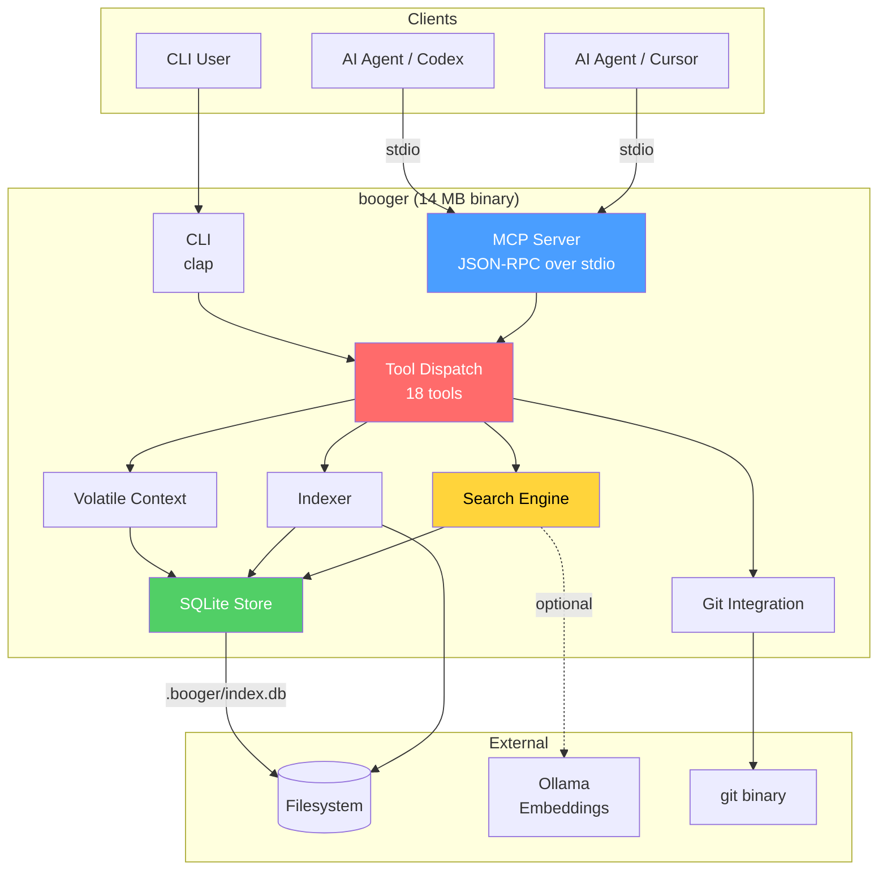
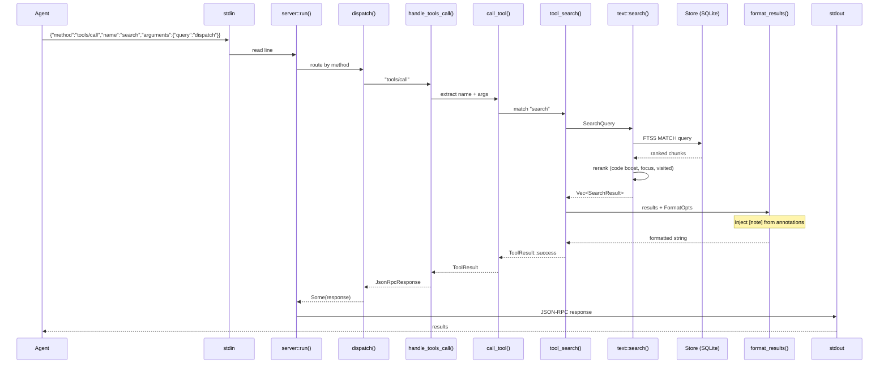
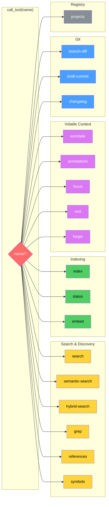
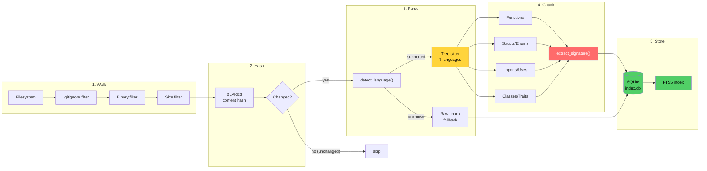
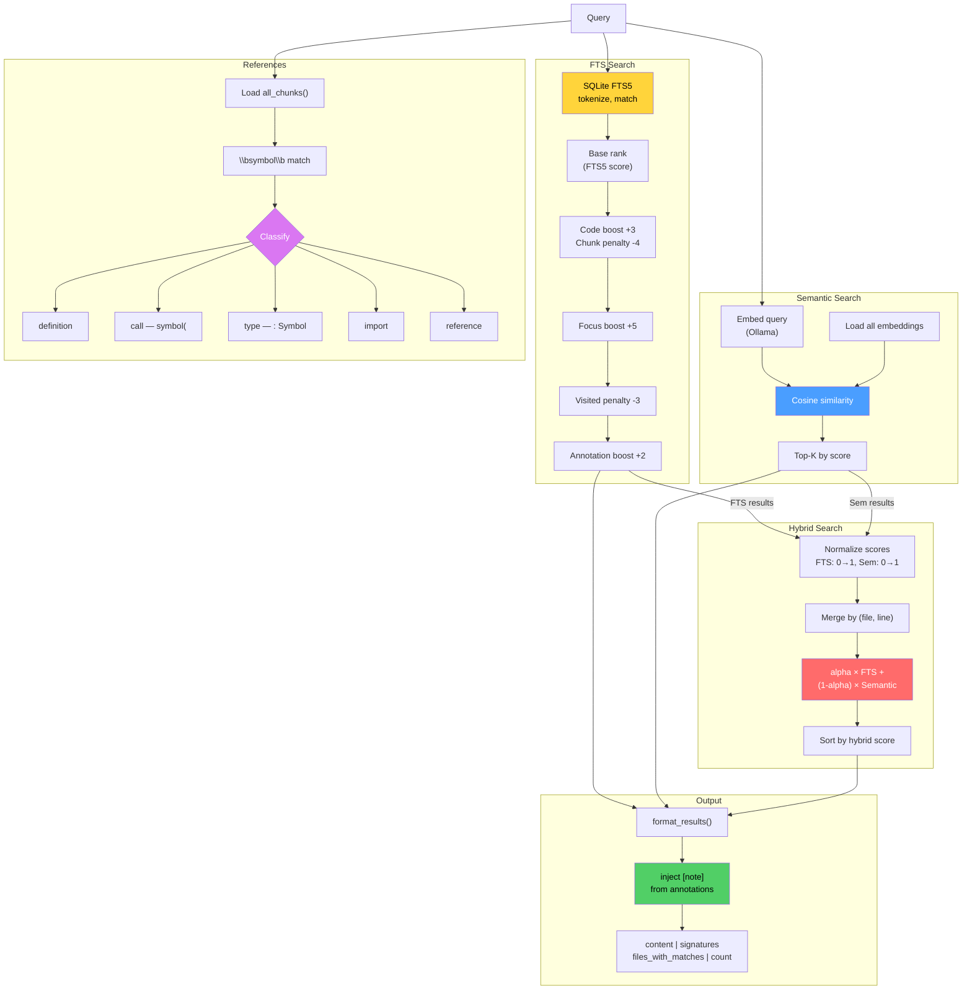
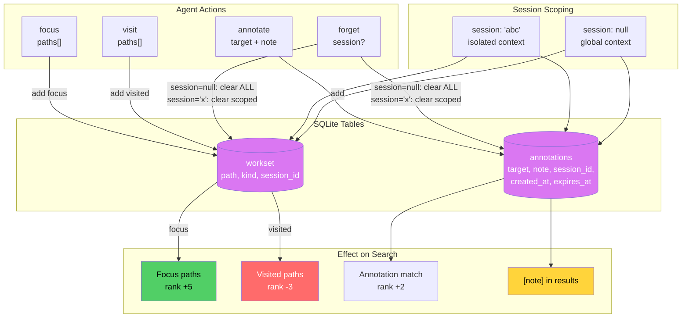
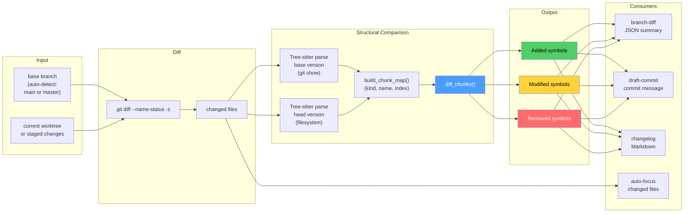
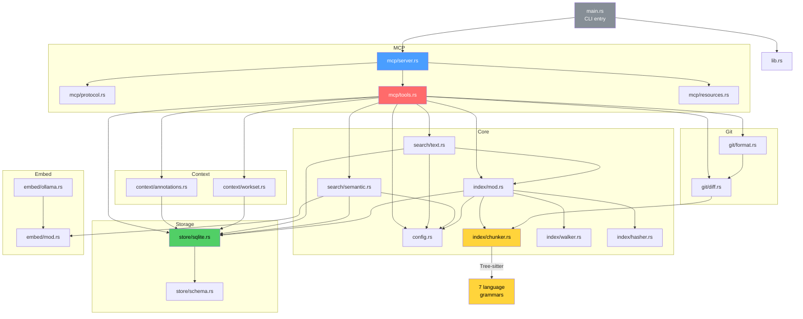
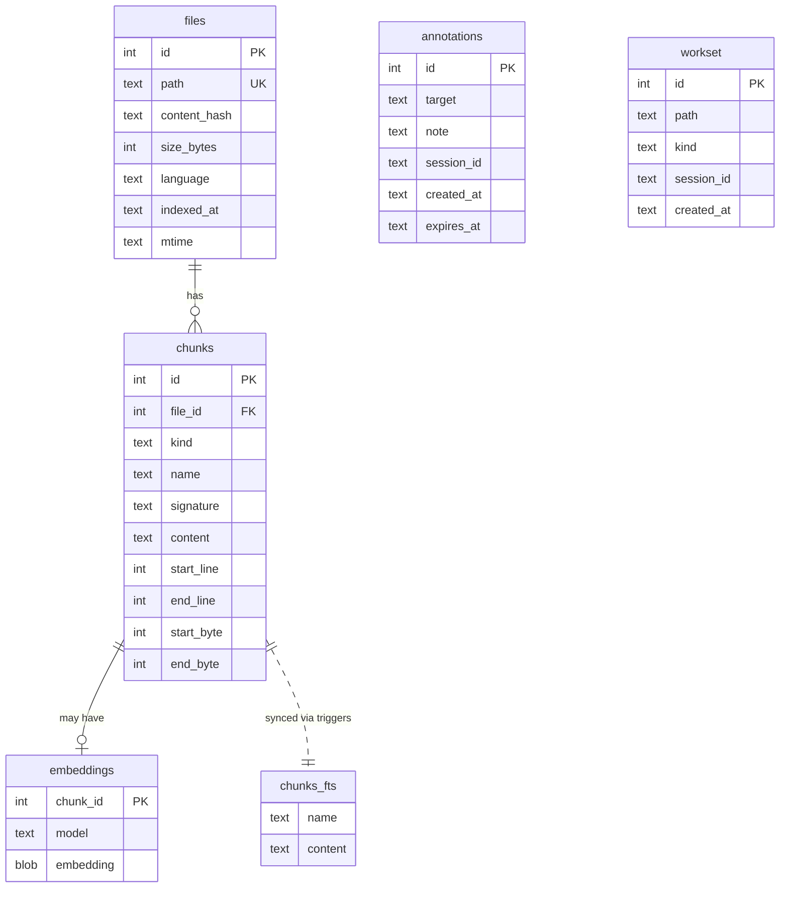

# Booger Architecture

## System Overview

## MCP Request Flow

## Tool Dispatch Map

## Indexing Pipeline

## Search Pipeline

## Volatile Context Layer

## Git Integration Flow

## Module Dependency Graph

## SQLite Schema (v5)

